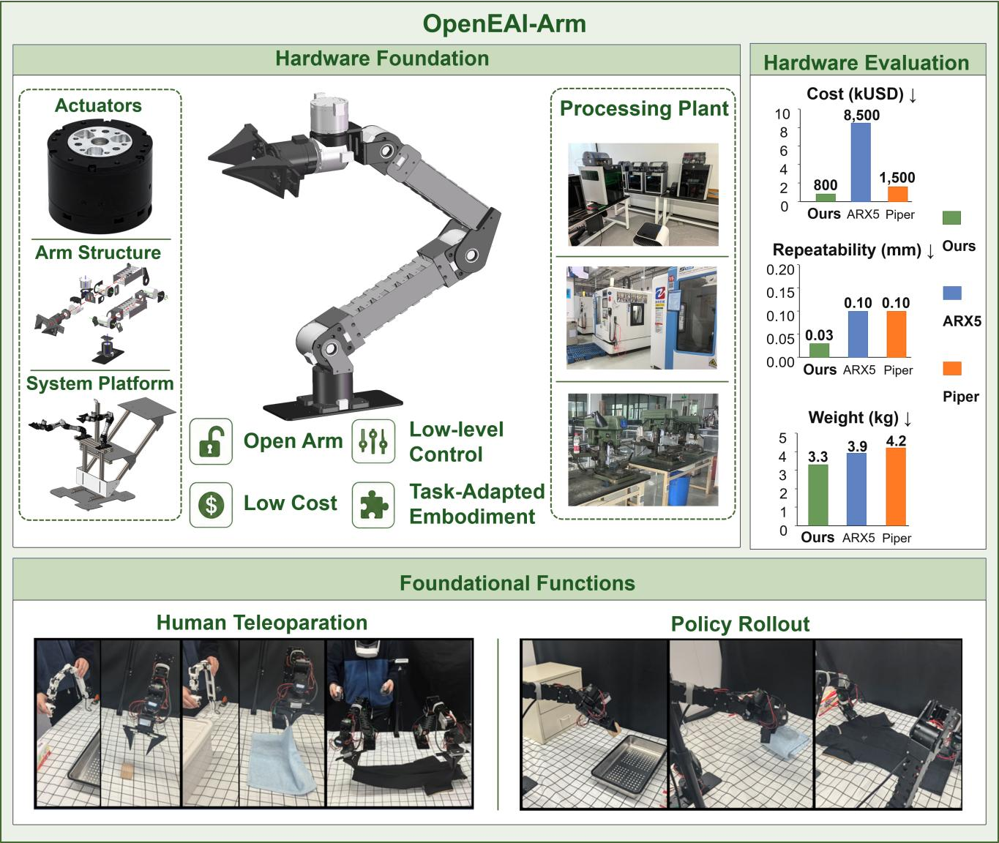

# OpenEAI-Arm

Open-source, low-cost, reproducible desktop robot hardware for embodied AI and real-world manipulation.



OpenEAI-Arm is a 6-DoF serial robot arm with an independently controlled end-effector channel. It is designed for embodied-AI research, robot-control development, real-world policy evaluation, teleoperation, and Vision-Language-Action (VLA) data collection. The repository provides the mechanical design, manufacturing files, robot model, low-level control stack, ROS 2 integration, teleoperation examples, and data-collection tools needed to reproduce and extend the platform.

The design prioritizes a practical balance among workspace, payload, mass, manufacturability, control access, and cost. It can be used as a complete experimental platform or as an open hardware foundation for replacing actuators, modifying links, integrating new end effectors, and building synchronized dual-arm systems.

> [!WARNING]
> A robot arm can move unexpectedly and generate hazardous forces. Rigidly secure the base, keep the workspace clear, verify the emergency stop, and begin with simulation followed by unloaded, low-speed, small-angle tests. Never hot-plug the 24 V power or CAN wiring.

## OpenEAI Ecosystem

OpenEAI-Arm is the robot-hardware and control foundation of the OpenEAI platform:

- [OpenEAI-VLA](https://github.com/eai-yeslab/OpenEAI-VLA) provides the Vision-Language-Action research and deployment stack.
- [OpenEAI-FOC](https://github.com/ZJYSII/OpenEAI-FOC) develops open joint hardware, drive electronics, sensing, and field-oriented motor control.
- OpenEAI-Arm connects policies to a reproducible physical system through kinematics, dynamics-aware control, CAN communication, ROS 2, teleoperation, and safety limits.

```text
OpenEAI-VLA policy and data pipeline
                  │ actions
                  ▼
OpenEAI-Arm coordination, kinematics, teleoperation, and safety
                  │ joint targets
                  ▼
OpenEAI-FOC / compatible joint actuators and end effector
                  │
                  └──────── joint state and sensor feedback ────────┘
```

## Highlights

### Open hardware

- Six rotary joints plus one independently controlled end-effector channel
- Modular actuators, links, base, cable routing, and end-effector interface
- BOM, STEP, STL, mechanical drawings, URDF/SDF, and assembly documentation
- Replaceable gripper, dexterous-hand, or sensor interface
- Suitable for single-arm, dual-arm, and task-adapted embodiments

### Open control stack

- C++ core library, Python bindings, and ROS 2 nodes
- CAN-based joint and end-effector communication
- Joint-space, end-effector incremental, and end-effector absolute-pose control
- Gravity, inertia, Coriolis, and friction compensation in the low-level stack
- Jerk-limited S-curve interpolation for smoother target execution
- Simulation and visualization through the shared robot model

### Teleoperation and embodied-AI workflows

- GELLO master-slave joint control
- SpaceMouse incremental Cartesian control
- VR absolute-pose teleoperation over UDP
- Single-arm and dual-arm operation with isolated configurations and topics
- Synchronized image, joint-state, and action collection for VLA datasets
- Policy rollout examples for real-world manipulation

## System Specifications

The following values describe the documented OpenEAI-Arm V0.9 prototype. Payload, speed, accuracy, and thermal performance depend on assembly quality, calibration, controller settings, end-effector mass, and operating conditions.

| Parameter | Specification |
| --- | --- |
| Active degrees of freedom | 6 |
| End-effector control channels | 1 |
| Maximum reach | 636.7 mm |
| Arm mass | 3.3 kg, excluding gripper |
| Nominal end payload | 2 kg, excluding gripper |
| Nominal power | 420 W |
| Peak current | 17.5 A |
| Theoretical maximum end-effector speed | 1.6 m/s |
| Rated joint torque | J1-J3: 9 N·m; J4-J7: 3 N·m |
| Maximum static joint torque | J1-J3: 27 N·m; J4-J7: 7 N·m |
| Prototype repeatability | ±0.03 mm |
| Gripper force range | 0.5-5 N |
| Joint and end-effector bus | CAN |
| Power input | 24 V DC, XT30 2+2 |
| Documented manufacturing cost | Approximately CNY 5,500 |
| Recommended environment | 0-40 °C; non-waterproof |

The comparison charts in the overview image are project evaluation results. When reproducing them, report the hardware revision, payload, trajectory, warm-up state, measurement equipment, sample count, and calculation method.

## Kinematics

The controller uses Modified Denavit-Hartenberg parameters matching the CAD and URDF. The fixed mechanical angle is `β = 13.85°`.

| Joint | θ (deg) | a (mm) | d (mm) | α (deg) |
| --- | ---: | ---: | ---: | ---: |
| J1, base rotation | 0 | 0 | 106.26 | 0 |
| J2, shoulder pitch | 180 | 19 | 0 | -90 |
| J3, elbow flexion | 180 + β | 269 | 0 | 180 |
| J4, wrist deviation | -β | 236.12 | 0 | 0 |
| J5, wrist pitch | 90 | 80 | 0 | 90 |
| J6, tool rotation | 0 | 0 | 29 | 90 |

The end-effector mounting envelope is approximately 57 mm × 35 mm and uses four M3 fasteners. Communication and power can be routed through the final joint using the CAN and XT30 2+2 harness.

## Repository Layout

```text
OpenEAI-Arm/
├─ hardware/
│  ├─ bom/                    # Bill of materials
│  ├─ STEP/                   # Assemblies and manufacturable CAD
│  ├─ stl/                    # Printable and visualization meshes
│  ├─ drawings/               # DWG/PDF manufacturing drawings
│  └─ assembly/               # Assembly documentation
├─ software/
│  ├─ configs/                # Arm, CAN, motor, zero, and limit settings
│  ├─ include/ and src/       # C++ control library
│  ├─ python/                 # Python bindings
│  ├─ ros2/                   # ROS 2 nodes, robot model, and examples
│  ├─ scripts/                # Visualization and utility scripts
│  └─ tests/                  # Hardware and software test programs
├─ assets/                    # README images and videos
├─ LICENSE
└─ THIRD_PARTY_NOTICES
```

- Hardware index: [`hardware/README.md`](hardware/README.md)
- Software, control, and teleoperation guide: [`software/README.md`](software/README.md)
- Default real-arm configuration: [`software/configs/default.yml`](software/configs/default.yml)
- ROS 2 node: [`software/ros2/src/openeai_arm/src/OpenEAIArm_node.cpp`](software/ros2/src/openeai_arm/src/OpenEAIArm_node.cpp)
- Control and data-collection examples: [`software/ros2/src/openeai_arm/examples/`](software/ros2/src/openeai_arm/examples/)

## Quick Start

### 1. Prepare the system

Ubuntu 22.04 and ROS 2 Humble are recommended.

```bash
sudo apt update
sudo apt install git build-essential cmake libyaml-cpp-dev libeigen3-dev liburdf-dev

git clone https://github.com/eai-yeslab/OpenEAI-Arm.git
cd OpenEAI-Arm/software
```

A Python 3.10 environment is recommended for keeping robot dependencies isolated:

```bash
conda create -n openeai python=3.10
conda activate openeai
```

Pinocchio, KDL, the Dynamixel SDK, and optional teleoperation dependencies require additional setup. Follow [`software/README.md`](software/README.md) before building the complete stack.

### 2. Build

Build the C++ library, ROS 2 packages, and Python bindings from the `software/` directory:

```bash
cmake -S . -B build -DCMAKE_BUILD_TYPE=Release
cmake --build build --target extra -j 8
```

To build the components separately:

```bash
# C++ core and tests
cmake -S . -B build -DCMAKE_BUILD_TYPE=Release
cmake --build build -j 8

# Python package
cmake -S . -B build -DCMAKE_BUILD_TYPE=Release \
  -DPYTHON_EXECUTABLE=$(python3 -c "import sys; print(sys.executable)")
cmake --build build --target pip_install -j 8

# ROS 2 workspace
cmake --build build --target ros2
source ros2/install/setup.bash
```

### 3. Verify in simulation first

Terminal 1:

```bash
cd OpenEAI-Arm/software
source ros2/install/setup.bash
ros2 launch openeai_arm_urdf_ros2 launch.py
```

Terminal 2:

```bash
cd OpenEAI-Arm/software
source ros2/install/setup.bash
ros2 run openeai_arm OpenEAIArm_node --ros-args \
  -p ctrl_mode:=2 -p frequency:=50
```

Use simulation to verify the robot model, coordinate frames, joint directions, reachable workspace, and topics. Stop the node before changing between simulation and real-hardware modes.

### 4. Configure the real arm

Before applying power, inspect [`software/configs/default.yml`](software/configs/default.yml):

- Serial device and communication settings
- CAN master/slave IDs for all six joints and the gripper
- Joint zero positions and direction signs
- Position, velocity, acceleration, and torque limits
- URDF path and end-effector configuration

The public default configuration uses `/dev/ttyACM0`, but the actual device path may differ. The first two actuator IDs in the public configuration are intentionally ordered differently from a simple `1, 2, ...` sequence; verify every physical joint against the configuration instead of assuming numeric order.

Add the user to the serial-device group if required, then log out and back in:

```bash
sudo usermod -aG dialout $USER
```

### 5. Start the real arm

Rigidly mount the base, clear the workspace, support the arm against an uncontrolled drop, and make the emergency stop immediately reachable.

```bash
cd OpenEAI-Arm/software
source ros2/install/setup.bash
ros2 run openeai_arm OpenEAIArm_node --ros-args \
  -p ctrl_mode:=0 -p frequency:=50 \
  -p config:=configs/default.yml
```

Inspect the current state before sending any target:

```bash
ros2 topic echo /openeai_arm/joint_states --once
ros2 topic echo /openeai_arm/eef_pose --once
ros2 topic hz /openeai_arm/joint_states
```

The `position` target contains seven values:

```text
[J1, J2, J3, J4, J5, J6, gripper]
```

Read the current position first. For initial motion, copy the current seven-value target and change only one joint by approximately 0.03-0.05 rad. Do not copy joint values from another arm.

## Control Modes

| Function | Settings | Purpose |
| --- | --- | --- |
| Joint position control | `ctrl_mode:=0`, `ee_pose:=0` | Send six joint targets plus gripper |
| Drag teaching | `ctrl_mode:=1` | Manually guide the arm while publishing joint state |
| Simulation | `ctrl_mode:=2` | Validate the model and control interface without motors |
| End-effector increments | `ctrl_mode:=0`, `ee_pose:=1` | Incremental Cartesian commands, typically SpaceMouse |
| Absolute end-effector pose | `ctrl_mode:=0`, `ee_pose:=2` | Absolute pose input, typically VR |

### GELLO master-slave control

```bash
ros2 run openeai_arm OpenEAIArm_node --ros-args \
  -p ctrl_mode:=0 -p frequency:=50 -p arm_name:=left

cd ros2/src/openeai_arm/examples
python gello_controller.py
```

### SpaceMouse control

```bash
sudo apt install libhidapi-dev
pip install git+https://github.com/bglopez/python-easyhid.git
pip install pyspacemouse

ros2 run openeai_arm OpenEAIArm_node --ros-args \
  -p ctrl_mode:=0 -p ee_pose:=1 -p frequency:=50

cd ros2/src/openeai_arm/examples
python spacemouse.py
```

### VR control

The example expects UDP data in the form `[x, y, z, qx, qy, qz, qw, gripper]` at approximately 50 Hz.

```bash
ros2 run openeai_arm OpenEAIArm_node --ros-args \
  -p ctrl_mode:=0 -p ee_pose:=2 -p frequency:=50

cd ros2/src/openeai_arm/examples
python vr.py
```

Validate direction, scale, coordinate frames, and initial-pose alignment in simulation before connecting the real arm.

## Dual-Arm Operation

Use independent device paths, node names, configurations, and target topics. Calibrate and test each arm separately before running both together.

```bash
# Left arm
ros2 run openeai_arm OpenEAIArm_node --ros-args \
  -p ctrl_mode:=0 -p frequency:=50 -p arm_name:=left \
  -r /joint_targets:=/left/joint_targets

# Right arm
ros2 run openeai_arm OpenEAIArm_node --ros-args \
  -p config:=configs/default_right.yml \
  -p ctrl_mode:=0 -p frequency:=50 -p arm_name:=right \
  -r /joint_targets:=/right/joint_targets
```

## VLA Data Collection

The examples support synchronized camera images, joint states, and actions. Start the arm, launch the required USB or RealSense camera nodes, and then run:

```bash
cd ros2/src/openeai_arm/examples
python collect_data.py --task_name pick_place --config config_left.yml
```

For dual-arm capture, see `config_multi.yml`. Record a short sample first and verify timestamps, dimensions, camera views, joint order, action units, and gripper values before collecting a full dataset.

## Recommended Test Sequence

1. Inspect the base, fasteners, cable routing, end effector, work area, and emergency stop.
2. Confirm the device path, CAN IDs, zero positions, direction signs, and limits.
3. Start RViz or drag mode and verify the pose and coordinate conventions.
4. Start the real node and confirm that all seven channels report continuous state.
5. Perform an unloaded, small-angle, single-joint motion test.
6. Run the target function while monitoring communication, current, temperature, and mechanical behavior.
7. Stop teleoperation or policy commands, return to a supported safe pose, and stop the arm node.
8. Confirm that the motors are disabled, support the arm, and disconnect 24 V power before adjustment or disassembly.

Immediately stop and disconnect power after unintended motion, collision, unusual noise, persistent CAN loss, overcurrent, overheating, burning odor, structural looseness, or high-frequency oscillation.

## Frequently Asked Questions

### The serial device cannot be opened

Check the actual `/dev/ttyACM*` or `/dev/ttyUSB*` path, USB cable, group permissions, and `can_config.id`. Reconnect only while power is safely removed, and log in again after changing `dialout` membership.

### A CAN node is missing or repeatedly disconnects

Power down first. Verify the 24 V supply, CAN high/low wiring, termination, bus rate, physical node IDs, and the master/slave IDs in the selected YAML configuration.

### A joint moves in the wrong direction

Use the emergency stop, correct the direction or zero setting in the configuration, and repeat an unloaded low-speed test. Do not compensate for a reversed joint only at the high-level policy layer.

### The arm jitters after startup

Stop motion and check the zero position, direction, encoder installation, structural fasteners, update frequency, and controller gains. Reduce gains and target changes before retesting.

### End-effector control jumps

Check units, reference pose, quaternion convention, coordinate frames, inverse-kinematics result, and initial alignment. Reproduce the command in simulation and reduce the increment or pose change.

### Pinocchio cannot be found

Check the installed Python version and the `PATH`, `PKG_CONFIG_PATH`, `LD_LIBRARY_PATH`, `PYTHONPATH`, and `CMAKE_PREFIX_PATH` entries for `/opt/openrobots`.

### Dual-arm topics interfere with each other

Use separate device paths, configuration files, arm names, node names, namespaces, and remapped target topics. Test each arm independently before enabling simultaneous motion.

## Citation

If OpenEAI-Arm contributes to your research, please cite the OpenEAI-Platform paper and identify the repository version or commit used:

```bibtex
@inproceedings{openeai_platform,
  title  = {OpenEAI-Platform: Open-source Embodied Artificial Intelligence Hardware-Software Unified Platform},
  author = {Jinyuan Zhang and Luoyi Fan and Leiyu Wang and Yeqiang Wang and Yichen Zhu and Cewu Lu and Nanyang Ye},
  year   = {2026}
}
```

## License

OpenEAI-Arm is licensed under the [BSD 3-Clause License](LICENSE). Third-party components remain subject to their respective licenses; see [`THIRD_PARTY_NOTICES`](THIRD_PARTY_NOTICES).

## Contributing and Support

Issues and pull requests are welcome. Include the hardware revision, operating system, configuration, supply conditions, command sequence, logs, and reproducible steps. For safety-related reports, describe the physical setup and tested limits.

- Repository: <https://github.com/eai-yeslab/OpenEAI-Arm>
- Open an issue for questions, bugs, or proposed changes
- Contact: ynylincoln@sjtu.edu.cn
